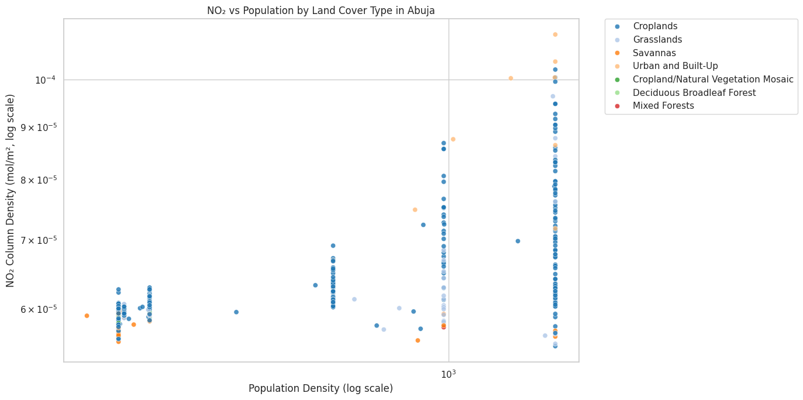

# 🌍 NO₂ Air Pollution vs Population Density in Abuja, Nigeria (2019–2025)

This project explores the relationship between **nitrogen dioxide (NO₂) pollution** and **population density** in **Abuja**, Nigeria's capital, using satellite-based data from 2019 to June 2025. It includes data visualization, land cover classification, and a correlation analysis using Google Earth Engine and Python.

## 📌 Overview

- 🛰️ **NO₂ Data**: Sentinel-5P (COPERNICUS/S5P/OFFL/L3_NO2)
- 👥 **Population Density**: GPWv4 (2020 revision)
- 🌱 **Land Cover Classification**: MODIS MCD12Q1 (2020)
- 🧪 **Analysis**: Correlation between NO₂ and population density, colored by land cover type
- 📅 **Study Period**: January 2019 – June 12, 2025

---

## 📊 Key Outputs

### 1. NO₂ Concentration over Time (2019–2025)

---

### 2. NO₂ vs Population Density by Land Cover

This scatterplot shows a positive correlation between **population density** and **NO₂ levels**, with a clearer pattern in **urban areas**. Logarithmic scales are used to manage skewed distributions and highlight trends across multiple orders of magnitude.

---

## 📂 Files in This Repository

| File | Description |
|------|-------------|
| `abuja_no2_analysis.ipynb` | Main Python notebook with full analysis |
| `NO2_vs_Population_by_LandCover_Abuja.png` | Scatterplot of NO₂ vs population |
| `Abuja_NO2_2019_2025.gif` | Animated visualization of NO₂ over time |
| `NO2_vs_Population_by_LandCover_Abuja.pdf` | One-page PDF report (optional) |

---

## 🔗 Medium Blog

📝 Read the full story on Medium:  
[👉 Insert your Medium blog link here 👈]

---

## 📌 How to Run This Notebook

You can run the analysis directly in [Google Colab](https://colab.research.google.com/) by opening the notebook file. Make sure to:

1. Authenticate with Google Earth Engine.
2. Use your own GEE project ID (or modify the `.Initialize()` line if running interactively).
3. Install necessary libraries: `geemap`, `ee`, `seaborn`, `matplotlib`.

---

## 📜 License

This project is released under the MIT License.

---

## 🤝 Acknowledgments

- European Space Agency (ESA) for Sentinel-5P data  
- NASA for MODIS MCD12Q1 land cover  
- CIESIN for GPWv4 population data  
- Google Earth Engine for enabling large-scale geospatial analysis

